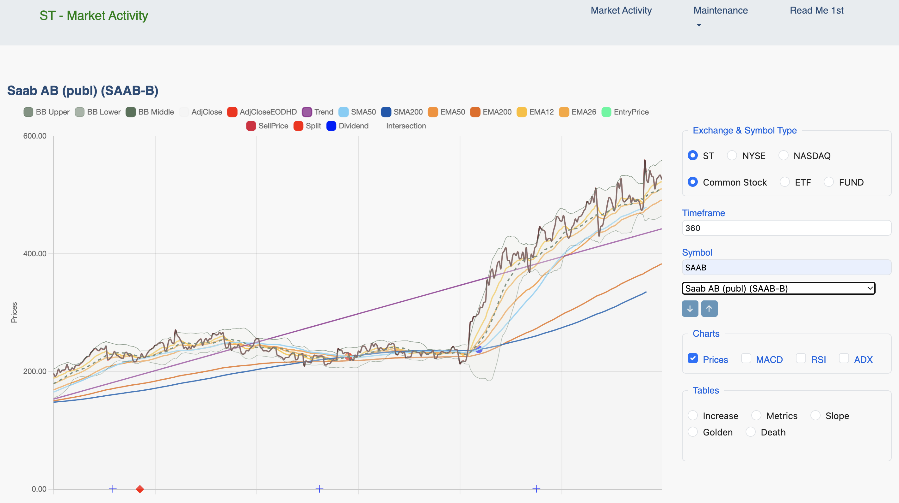

### Using the Market Activity Page

The "**Market Activity**" page is the primary interface for analyzing individual stocks. 
It consists of a main chart area on the left and a control panel on the right, allowing you to customize the data you see.

### Initial View

When you first load the page, the chart area will be blank with the message "**Symbol Not Selected**".
All controls are located in the right-hand panel, ready for you to make your selections.

### Control Panel Overview

The control panel on the right allows you to define what data is displayed.

#### Exchange & Symbol Type {#MA-Exchange-help}
Select the stock exchange (e.g., ST, NYSE, NASDAQ) and the type of instrument (e.g., Common Stock, ETF, FUND) you want to analyze. The available symbols in the dropdown list will update automatically based on your selection.

#### Timeframe {#MA-Timeframe-help}
Enter the number of trading days you wish to view in the chart. The default is 360 days (≈ 1.5 years of trading data).

#### Symbol {#MA-SymbolSearch-help}

**Search**: You can type in the "Search symbol..." box to quickly filter the list.

**Dropdown List**: Click the dropdown to see all available symbols for the selected Exchange and Type. Selecting a symbol from this list will load its data and draw the chart.

**Arrow Buttons**: The up (↑) and down (↓) arrows allow you to quickly cycle through the symbols in the dropdown list one by one.

#### Charts {#MA-Charts-help}

Use these checkboxes to toggle the visibility of the different chart panels.

**Prices**: This is the main price chart. It is enabled by default.

**MACD, RSI, ADX**: Check these to display their corresponding indicator charts below the main price chart.

#### Tables {#MA-Tables-help}

Select a radio button to display a specific data table for the selected exchange and type. The tables provide a way to screen all stocks for specific criteria.

**Increase**: Provides a detailed table of calculated information of percentage raise of the adjusted Closeprice.

**Metrics**: Provides a detailed table of calculated metrics like ROC (Rate of Change) and R-Squared for all symbols.

**Slope**: Shows a ranked list of stocks based on the strength and direction of their price trend.

**Golden/Death Cross**: Displays lists of stocks that have recently experienced these bullish or bearish crossover signals.

### Analyzing a Symbol

Once you select a symbol from the dropdown list, the page will come to life.

#### The Chart Area

The main chart area will display the price history for the selected symbol over your chosen timeframe.

#### Customizing the Chart View (Chart Legend)

By default, all available price indicators (like SMAs, EMAs, Bollinger Bands, etc.) are displayed on the chart. This can make the initial view look very busy.

You have full control over what is visible using the interactive **chart legend** located at the top of the chart.

**To Hide an Indicator**: Simply click on its name in the legend (e.g., click on "EMA50"). The line will disappear from the chart, and its legend item will become 'greyed out'.

**To Show an Indicator**: Click on a greyed-out legend item to make its line reappear on the chart.

This allows you to de-clutter the view and focus on only the indicators that are important for your current analysis. The application will remember your choices for the duration of your session.

#### Split
Find below the meaning of splitRatio. They indicates two very different types of corporate actions that SplitRatio can represent.

##### Splitratio > 1
If splitratio is > 1 it indicates a **Forward Split**

**Example**

  SplitRatio = 6.00000

  - This signifies a standard 6-for-1 Forward Stock Split 
  - This is very common when a company's stock price gets "too high" and they want to make it more accessible to regular investors

  **What happens**

  You get more shares, but each share is worth less

  - Shares: Multiplied by 6 
  - Price:  Divided by 6 
  - Before: You own 100 shares at 600 each with a total Value of 60.000 
  - After:  You now own 600 shares at 100 each with a total value of 60.000

##### SplitRatio < 1
  If splitratio < 1 it indicates a **Reverse Split** or a **Corporate Action Adjustment Factor** (if a "messy" decimal)

**Example 1**

  SplitRatio = 0.955172 (Adjustment Factor / Spinoff)

  - When you see a **messy** decimal less than 1 like this, it is **almost never** a standard Reverse Split.
  - It usually indicates a **Corporate Action Adjustment Factor**, most commonly due to a **Spinoff** or a **huge Special Dividend**.

  **Why does this happen?**

  Imagine Company A is worth 100 a share.

  It decides to take one of its smaller divisions and turn it into a separate, new company (Company B). They give every shareholder of Company A some shares of Company B.

  On the day this happens, Company A is now "worth less" because it no longer owns that division.

  Let's say that division was roughly 4.5% of the company's total value. The stock price of Company A might instantly drop from 100 to roughly 95.50.

  To prevent historical charts from showing a massive, fake "crash" on that day, data providers apply a SplitRatio of roughly 0.955 to all historical prices.

  This smoothly connects the old "pre-spinoff" prices with the new "post-spinoff" prices.

  **What happens**

  You usually keep your original shares of the parent company, but you also get new shares of the spun-off company.
  The "split" ratio here is just a mathematical tool to adjust historical charts so they look correct.

  - Historical prices are multiplied by ~0.955 to adjust them downwards, matching the new reality of the company's smaller size.

**Example 2**

  SplitRatio = 0.5 signifies a 1-for-2 Reverse Stock Split.

  **Number of Shares Decreases**

  - For every two shares you owned before the split, you will own only one share after the split. The number of shares you hold is multiplied by the split ratio.

  If you owned 100 shares, you will have 100 * 0.5 = 50 shares after the split.

  **Share Price Increases**

  - To keep the total value of your investment the same, the price per share is divided by the split ratio (which is the same as multiplying by 2).

  If the stock was trading at 10 per share before the split, its price will theoretically adjust to 10 / 0.5 = 20 per share immediately after the split.

  **Total Market Value Stays the Same**

  - A reverse split does not, by itself, create or destroy value
  - The total value of your holding remains unchanged at the moment of the split

  >  | Metrics           | Before Split | After Split|
  >  | ----------------- | ------------ | ---------- |
  >  | Number of Shares  | 100          | 50         |
  >  | Price per Share   | 10.00        | 20.00      |
  >  | Total Value       | 1.000        | 1.000      |

  **Why Do Companies Do This?**

  Companies typically perform a reverse stock split for a few key reasons:
  > To Meet Exchange Requirements
  >> Major stock exchanges like the NASDAQ and NYSE require stocks to maintain a minimum price (e.g., $1.00 per share).

  >> If a stock's price falls below this threshold for too long, it risks being delisted.

  >> A reverse split artificially boosts the price back into compliance.

  > To Attract Investors
  >> Very low-priced stocks (often called "penny stocks") can be perceived as speculative or risky.

  >> A higher stock price can improve market perception and attract more institutional investors and funds that may have rules against buying stocks below a certain price.

### Using the Data Tables

The "Tables" section in the control panel provides a powerful way to screen and analyze all stocks on the selected exchange based on specific criteria.

Instead of showing multiple tables at once, this area features a dynamic table that changes its content based on your selection.

**Selecting a Table**
To view a specific analysis, simply select one of the radio buttons:

> **Increase**:

> **Metrics**: Provides a comprehensive table with key calculated metrics for all stocks, including:

>> **ROC (Rate of Change)**: The percentage price change over the selected timeframe.

>> **Slope**: The log-linear trendline slope, indicating the average daily compounded growth rate.

>> **R2 (R-Squared)**: A statistical measure (from 0 to 1) of how consistently the price has followed its trendline. A higher value indicates a more reliable, steady trend.

> **Slope**: Displays a ranked list of stocks based on the strength and direction of their price trend over the chosen timeframe. This helps you quickly find stocks with the strongest upward or downward momentum.

> **Golden Cross**: Lists all stocks that have recently experienced a "Golden Cross" – a bullish signal where a short-term moving average (like the 50-day) crosses above a long-term one (like the 200-day).

>**Death Cross**: The opposite of a Golden Cross. This lists stocks that have recently experienced a "Death Cross" – a bearish signal where the short-term moving average crosses below the long-term one.

### Sorting the Tables

All tables in this section are interactive and can be sorted by any column to fit your analysis needs.

- **To Sort**: Simply click on any column header. The table will be sorted by that column's data, typically in descending order (highest to lowest) by default. An arrow (▲ or ▼) will appear next to the header to indicate the current sort order.
- **To Change Sort Direction**: Click the same column header again to toggle the sort direction between descending (▼) and ascending (▲).

This functionality allows you to instantly re-rank the data. For example, in the "Metrics" table, you can:

- Click the **ROC** header to find the stocks with the highest percentage gain.
- Click the **Slope** header to find stocks with the steepest, most consistent uptrend.
- Click the **R2** header to find stocks whose price movements have been the most predictable and linear over the period.

This dynamic sorting is performed instantly in your browser without needing to reload data from the server, providing a fast and responsive way to explore the market data.

### A Note on Performance and Real-time Data

When you select a table for the first time or change a filter like Exchange, Symbol Type, or Timeframe, the application sends a request to the server to perform the necessary calculations.

All data presented in the tables is calculated in real-time based on your specific selections.

This means that if you request a "Slope" analysis for all stocks on the NYSE over a 360-day period, the server will:

- Fetch the relevant price history for hundreds or thousands of stocks.
- Perform a linear regression calculation for each one.
- Rank the results and send them back to be displayed.

This is a computationally intensive process.

While I have optimized it as much as possible, please have a moment of patience as the calculations are performed.

The loading spinner indicates that the system is actively working on your request.

Subsequent actions, such as sorting the table by clicking on a column header, are performed instantly in your browser without any delay.
